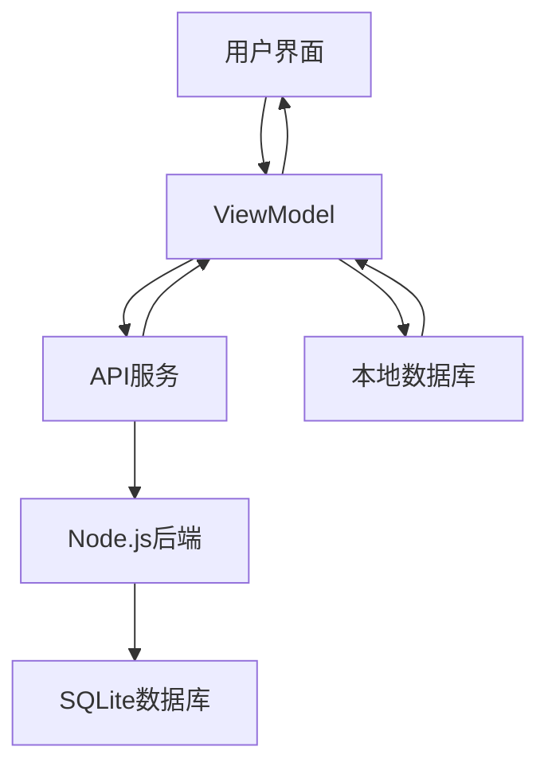

## 产品概述

将现有的Web版CalSum（食物热量与运动追踪器）迁移为Flutter移动应用，支持Android和iOS双平台，基于现有Node.js后端API对接，保持多设备数据同步能力。

## 核心功能

- 用户认证与登录
- 食物记录管理（添加、编辑、删除、查看）
- 运动记录管理（添加、编辑、删除、查看）
- 每日数据统计与汇总
- 数据导出功能
- 多设备数据同步

## 技术栈

- 移动端：Flutter + Dart
- 后端对接：现有Node.js + Express + SQLite API
- 状态管理：Provider或Riverpod
- 网络请求：Dio或http包
- 本地存储：shared_preferences + sqflite（用于离线缓存）

## 技术架构

### 系统架构

- 架构模式：MVVM架构（Model-View-ViewModel）
- 组件结构：主应用 → 页面组件 → 业务逻辑层 → 数据访问层
- 数据流：用户操作 → ViewModel → API调用 → 本地缓存 → UI更新

### 模块划分

- **用户认证模块**：登录、注册、用户信息管理
- **食物管理模块**：食物记录CRUD操作、食物数据库查询
- **运动管理模块**：运动记录CRUD操作、运动类型管理
- **数据统计模块**：每日热量统计、运动消耗计算
- **数据同步模块**：与后端API的数据同步、离线缓存
- **数据导出模块**：Excel/CSV格式数据导出

### 数据流



## 实现细节

### 核心目录结构

```
calsum_flutter/
├── lib/
│   ├── models/           # 数据模型
│   │   ├── user.dart
│   │   ├── food.dart
│   │   ├── exercise.dart
│   │   └── daily_summary.dart
│   ├── services/         # 服务层
│   │   ├── api_service.dart
│   │   ├── auth_service.dart
│   │   ├── food_service.dart
│   │   ├── exercise_service.dart
│   │   └── local_storage.dart
│   ├── viewmodels/       # ViewModel层
│   │   ├── auth_viewmodel.dart
│   │   ├── food_viewmodel.dart
│   │   ├── exercise_viewmodel.dart
│   │   └── summary_viewmodel.dart
│   ├── views/            # 页面组件
│   │   ├── login_page.dart
│   │   ├── home_page.dart
│   │   ├── food_page.dart
│   │   ├── exercise_page.dart
│   │   └── summary_page.dart
│   ├── widgets/          # 可复用组件
│   │   ├── food_item.dart
│   │   ├── exercise_item.dart
│   │   └── summary_card.dart
│   └── main.dart
├── pubspec.yaml
└── assets/
```

### 关键技术实现

**数据模型接口**：定义与现有后端API兼容的数据结构

```
class Food {
  final String id;
  final String name;
  final double calories;
  final double protein;
  final double carbs;
  final double fat;
  final DateTime createdAt;
  
  Food({required this.id, required this.name, required this.calories, 
        required this.protein, required this.carbs, required this.fat, 
        required this.createdAt});
}
```

**API服务接口**：封装与现有Node.js后端的通信

```
class ApiService {
  final String baseUrl;
  
  Future<List<Food>> getFoods() async { }
  Future<Food> addFood(Food food) async { }
  Future<void> updateFood(String id, Food food) async { }
  Future<void> deleteFood(String id) async { }
}
```

## 技术考虑

### 性能优化

- 使用ListView.builder进行列表渲染优化
- 实现数据分页加载
- 本地缓存减少网络请求
- 图片懒加载

### 数据同步策略

- 离线优先：本地操作立即生效，后台同步到服务器
- 冲突解决：基于时间戳的最终一致性策略
- 增量同步：只同步变更数据

### 安全性

- JWT token认证
- HTTPS通信加密
- 敏感数据本地加密存储

## 设计风格

采用现代化移动应用设计风格，遵循Material Design 3设计规范，为CalSum应用打造直观、美观的移动端体验。设计重点在于数据可视化、操作便捷性和移动端适配性。

## 页面规划

基于现有Web应用功能，规划以下核心页面：

1. **登录页面**：简洁的认证界面，支持用户名密码登录
2. **主页仪表板**：显示今日热量摄入/消耗概览，快速入口
3. **食物记录页面**：食物添加、编辑、删除和列表展示
4. **运动记录页面**：运动添加、编辑、删除和列表展示
5. **数据统计页面**：图表展示热量趋势和运动数据
6. **设置页面**：用户设置、数据导出功能

## 页面块设计

### 登录页面

- **顶部Logo区域**：应用Logo和标题，居中显示
- **登录表单区域**：用户名、密码输入框，Material Design风格
- **操作按钮区域**：登录按钮、注册链接，圆角设计
- **底部信息区域**：版本信息和版权声明

### 主页仪表板

- **顶部导航栏**：应用标题、用户头像、设置入口
- **今日概览卡片**：圆形进度条显示热量目标完成度
- **快速操作区域**：添加食物、添加运动快捷按钮
- **最近记录区域**：最近添加的食物和运动列表
- **底部导航栏**：主页、食物、运动、统计、设置的Tab导航

### 食物记录页面

- **搜索和筛选栏**：食物搜索框、分类筛选
- **添加按钮**：悬浮操作按钮，Material Design FAB
- **食物列表**：卡片式布局，显示食物名称、热量、营养素
- **空状态提示**：无数据时的友好提示和引导

### 数据统计页面

- **时间筛选器**：日、周、月视图切换
- **热量趋势图表**：折线图展示热量摄入消耗趋势
- **营养素分布**：饼图展示蛋白质、碳水、脂肪比例
- **运动统计**：柱状图展示运动类型和消耗热量